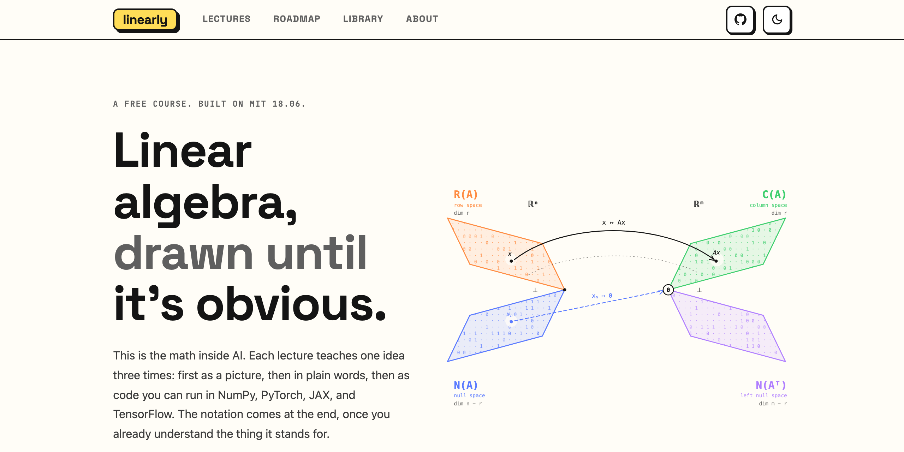

# linearly

**The math of AI, drawn and coded.** A free, community-grown linear algebra course for people
building AI, live at **[linearly.space](https://linearly.space)**.

[](https://linearly.space)

Every lecture teaches the same idea four ways:

1. **Slides**: the visual narrative, in a fast built-in viewer
2. **Article**: a plain-language explanation written to be understood on the first pass
3. **Drawings**: hand-drawn diagrams, shown exactly as drawn; every one on the site is the
   1:1 export of an [Excalidraw](https://excalidraw.com) source in `drawings/`
4. **Code**: the concept executed in NumPy, PyTorch, JAX, and TensorFlow

The course is a **reading companion to [MIT 18.06](https://web.mit.edu/18.06/www/)**: every
lecture maps to Strang's lectures and *Introduction to Linear Algebra* (6th ed.). The original
lectures were written and taught live in 2022 and 2023, before the LLM era; every explanation
was worked out by hand for a room of real students.

## Course map

| Part | Lectures | Status |
|---|---|---|
| I. Foundations | 00 How machines learn, 01 Vectors & dimensions, 02 Matrices & transformations, 03 NumPy & tensors | live |
| II. Solving Ax = b | 04 Elimination, 05 The algebra of matrices, 06 Factorizations A = CR and A = LU | live |
| III. Vector Spaces | 07 Vector spaces & subspaces, 7.5 The null space, 08 The complete solution & rank, 09 The four subspaces & the rank theorem | live |
| IV. Orthogonality | 10 Orthogonal subspaces, 11 Projections, 12 Least squares, 13 Gram–Schmidt & QR | live |
| V. Determinants & Eigenvalues | 14 Determinants, 15 Eigenvalues & positive definiteness | live |
| VI. The Missing Third | 16–22: SVD, pseudoinverse, low-rank & PCA, complex eigenvalues, Fourier, convolution, capstone | planned |
| VII. The Machine | 23–28: memory layout, CPU matmul, the GPU, GEMM kernels, the asynchronous kernel, CUTLASS & CuTe, sparse matrices | live |
| VIII. Adaptation | 29 PEFT: LoRA, the adapter zoo, and fine-tuning as the course's own linear algebra | live |

Also on the site: **[the roadmap](https://linearly.space/roadmap)**, an honest staged path for
learning this subject, and **[the library](https://linearly.space/resources)**, a
hard-curated shelf of the best books, videos, and tools, each with a note on how it teaches.

## A course meant to be grown

linearly started as one person's lecture series, but it is written and organized so a community
can carry it further: one file per lecture, a documented path for every kind of contribution,
and a style guide that keeps a hundred authors sounding like one course. If you learned
something here and see how to teach it better, that belongs in the course. Everyone who has
improved it appears on **[the contributors page](https://linearly.space/contributors)**,
rebuilt from this repository's history on every deploy.

- **[CONTRIBUTING.md](CONTRIBUTING.md)**: how to fix, improve, and extend the course
- **[CODE_OF_CONDUCT.md](CODE_OF_CONDUCT.md)**: how we work together
- **[AGENTS.md](AGENTS.md)**: the full rulebook for AI coding agents working on this repo

## Quick start

```bash
pnpm install
pnpm dev        # local dev server
pnpm build      # production build + search index
```

Requires Node ≥ 22. The stack: [Astro](https://astro.build) (static output), MDX content,
build-time KaTeX math, Shiki dual-theme code highlighting, Pagefind search, zero client-side
frameworks. Astro is pinned in `package.json` (see the note in `.npmrc` about release-cooldown
policies).

## Repository layout

```
src/content/lectures/   ← one .mdx file per lecture (the article + front matter)
src/components/         ← SlideViewer, CodeTabs, Callout, Figure, playgrounds, …
src/assets/hero-art.svg ← generated identity art (pnpm exec node scripts/generate-art.mjs)
src/pages/              ← home, lectures, roadmap, resources, about
public/slides/<deck>/   ← optimized WebP slide images (1.webp … N.webp)
scripts/                ← slide pipeline (macOS) + hero-art and thumbnail generators
drawings/               ← Excalidraw sources for every diagram
```

## Design

The visual language is neobrutalist, adapted from
[Brutal](https://github.com/eliancodes/brutal) by Elian Van Cutsem (MIT). Diagrams are drawn in
[Excalidraw](https://excalidraw.com); sources live in `drawings/`, and every figure can replay
itself in its authored order via the play chip beside its label, an idea owed to
[excalidraw-animate](https://github.com/dai-shi/excalidraw-animate) and
[Excalimate](https://github.com/excalimate/excalimate).

## Citing this course

If this course is useful in your teaching, writing, or research, cite it. GitHub's
"Cite this repository" button generates the reference from [CITATION.cff](CITATION.cff),
or copy:

> Khalilli, A. and the linearly contributors. *linearly: the math of AI, drawn and coded.*
> https://linearly.space

## License: free to learn from, not for sale

This project is free for individuals, classrooms, and research, and all of its source is
public. It is
**not** available for commercial use: nobody may sell it, paywall it, or build paid products
from it, and every adaptation must stay under the same terms.

- **Code** (components, scripts, styling): [PolyForm Noncommercial 1.0.0](LICENSE)
- **Content** (articles, drawings, slides, exercises): [CC BY-NC-SA 4.0](LICENSE-CONTENT)

If you are unsure whether your use counts as commercial, open an issue and ask.

## In memory of Aqshin

This project is dedicated to Aqshin, one of the very first Azerbaijani students to study
computer science at MIT, and the friend who told me about MIT OpenCourseWare in 2015. That
conversation set everything here in motion.

© 2026 Ali Khalilli and the linearly contributors
